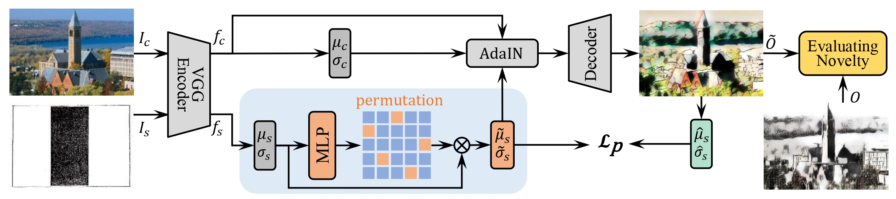

<!-- ABOUT THE PROJECT -->
## Creative Style Transfer

<!--  -->

Generating creative styles from a single style is a challenging problem for style transfer that aims at only transferring the style of an image to a content image. In this paper, we introduce a creativity process for producing new and meaningful artistic styles, called creative style transfer (CSFer). We first propose a permutation creativity to sort the feature maps of the style image to adjust the feature maps of the content image, producing the desired stylization content. Essentially, this permutation is capable of increasing the bases of styles, instead of the linear combination of multi-styles. We then employ perceptual and structural metrics to evaluate the quality of our stylized content by comparing it to the stylized content generated by traditional style transfer methods. Finally, we train the MLP network by randomly sampling a permutation matrix that satisfies the creativity criteria of the stylized content. Experimental results demonstrate that our CSFer can create novel and original stylization outcomes.

